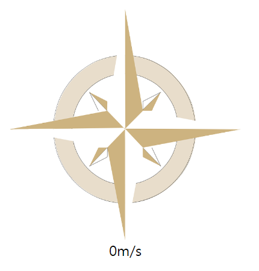

# javascript30-speedometerNcompass
Simple speed meter and compass using Geolocation API.

## Running the tests
click [here](https://ginnyang2.github.io/javascript30-speedometerNcompass/) 
Should run on safari Geolocation iOS simulator

  

